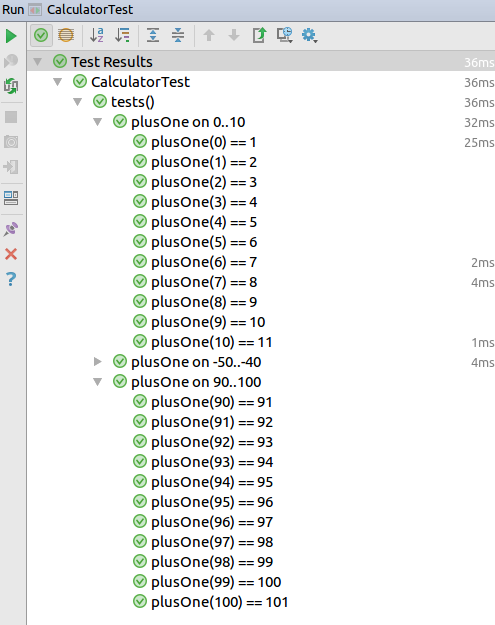

# DynaTest Dynamic Testing

[](https://github.com/mvysny/dynatest/tags)
[](https://maven-badges.herokuapp.com/maven-central/com.github.mvysny.dynatest/dynatest-engine)
[](https://github.com/mvysny/dynatest/actions/workflows/gradle.yml)

The simplest and most powerful testing framework for Kotlin.

We promote builders over annotations. Instead of having annotations forming an unfamiliar
[embedded mini-language, interpreted by magic at runtime](https://blog.softwaremill.com/the-case-against-annotations-4b2fb170ed67),
we let you create your test methods using Kotlin - an actual programming language familiar to you.

We don't program in annotations, after all. We program in Kotlin.

Java compatibility matrix:
* DynaTest 0.19 and lower require Java 7+
* DynaTest 0.20+ require Java 8+

## Example Code

Code example of the [CalculatorTest.kt](dynatest-engine/src/test/kotlin/com/github/mvysny/dynatest/CalculatorTest.kt):

```kotlin
class Calculator {
    fun plusOne(i: Int) = i + 1
    fun close() {}
}

/**
 * A test case.
 */
class CalculatorTest : DynaTest({

    /**
     * Top-level test.
     */
    test("calculator instantiation test") {
        Calculator()
    }

    // you can have as many groups as you like, and you can nest them
    // 'group' has no semantic definition, you are free to assign one as you need
    group("tests the plusOne() function") {

        // demo of the very simple test
        test("one plusOne") {
            expect(2) { Calculator().plusOne(1) }
        }

        // nested group
        group("positive numbers") {
            // you can even create a reusable test battery, call it from anywhere and use any parameters you like.
            calculatorBattery(0..10)
            calculatorBattery(100..110)
        }

        group("negative numbers") {
            calculatorBattery(-50..-40)
        }
    }
})

/**
 * Demonstrates a reusable test battery which can be called repeatedly and parametrized.
 * @receiver all tests+groups do not run immediately, but instead they register themselves to this group; they are run later on
 * when launched by JUnit5
 * @param range parametrized battery demo
 */
fun DynaNodeGroup.calculatorBattery(range: IntRange) {
    require(!range.isEmpty())

    group("plusOne on $range") {
        lateinit var c: Calculator

        // analogous to @Before in JUnit4, or @BeforeEach in JUnit5
        beforeEach { c = Calculator() }
        // analogous to @After in JUnit4, or @AfterEach in JUnit5
        afterEach { c.close() }

        // we can even generate test cases in a loop
        for (i in range) {
            test("plusOne($i) == ${i + 1}") {
                expect(i + 1) { c.plusOne(i) }
            }
        }
    }
}
```

Running this in your IDE will produce:



## Using DynaTest In Your Projects

### Example Project

Please see [karibu-helloworld-application](https://github.com/mvysny/karibu-helloworld-application)
for a very simple Gradle-based project employing DynaTest, to see how to integrate DynaTest
with your app.

### Gradle+DynaTest Integration Guide

DynaTest runs on top of JUnit5 engine, but it ignores any JUnit5 tests and only runs `DynaTest` tests. As a first step,
add the test dependency on this library to your `build.gradle` file:

```groovy
repositories {
    mavenCentral()
}
dependencies {
    testCompile("com.github.mvysny.dynatest:dynatest-engine:x.y")
}
```

> Note: check the tag number on the top for the newest version

DynaTest will transitively include JUnit5's core.

If you are using older Gradle 4.5.x or earlier which does not have native support for JUnit5, to actually
run the tests you will need to add the [junit5-gradle-consumer](https://github.com/junit-team/junit5-samples/tree/r5.0.3/junit5-gradle-consumer)
plugin to your build script. Please see the plugin's documentation for details.

If you are using Gradle 4.6 or later, JUnit5 support is built-in; all you need to enable it is to insert this into your `build.gradle` file:

```groovy
test {
    useJUnitPlatform()
}
```
or `build.gradle.kts`:
```kotlin
tasks.withType<Test> {
    useJUnitPlatform()
}
```

(more on Gradle's JUnit5 support here: [Gradle JUnit5 support](https://docs.gradle.org/4.6-rc-1/release-notes.html#junit-5-support))

If you want to run JUnit5 tests along the DynaTest tests as well, you can run both DynaTest test engine along with JUnit5 Jupiter engine
(which will only run JUnit5 tests and will ignore DynaTest tests):

```groovy
dependencies {
    testRuntime("org.junit.jupiter:junit-jupiter-engine:5.4.0")
}
```

## DynaTest Guide

DynaTest is composed of just 6 methods (and 0 annotations).

Calling the `test("name") { test body }` function creates a new test and schedules it to be run by JUnit5 core. Example:
```kotlin
class MyTest : DynaTest({
  test("'save' button saves data") {
    button.click()
    expect(1) { Person.findAll().size }
  }
})
```

Calling the `group("name") { register more groups and tests }` function creates a test group and allows you to define tests (or
more groups) inside of it. By itself the group does nothing more than nesting tests in your IDE output when you run
tests; however it becomes very powerful with the lifecycle methods `beforeGroup`/`afterGroup`. Example:
```kotlin
class MyTest : DynaTest({
  group("String.length tests") {
    test("Empty string has zero length") { 
      expect(0) { "".length }
    }
  }
})
```

> Technical detail: You write your test suite by extending the `DynaTest` class. The DynaTest constructor runs a block
which allows you to register tests and groups.
The block is pure Kotlin so you can use for loops, reusable functions and all features of the Kotlin programming language.

### Test Lifecycle Listeners

Often you need to prepare some kind of environment before a test, and tear it down afterwards. For that simply call
the following functions:

`beforeEach { body }` schedules given block to run before every individual test, both in this group and in all subgroups. If the body fails,
the test is not run and is marked failed. Example:
```kotlin
class CalculatorTest : DynaTest({
    lateinit var calculator: Calculator
    beforeEach { calculator = Calculator() }
    afterEach { calculator.close() }
    
    test("0+1=1") {
      expect(1) { calculator.plusOne(0) }
    }
})
```

`afterEach { body }` schedules given block to run after every individual test, both in this group and in all subgroups.
The body is ran even if the test itself or the `beforeEach` block failed. See `beforeEach` for an example.

`beforeGroup { body }` schedules given block to run once before every test in this group. The block won't run again for subgroups.
If the block fails, no tests/beforeEach/afterEach from this group and its subgroups are executed and they will be all marked as failed. This is a
direct replacement for `@BeforeClass` in JUnit, but it is a lot more powerful since you can use it on subgroups as well. You
typically use `beforeGroup` to start something that is expensive to construct/start, e.g. a Jetty server:
```kotlin
class ServerTest : DynaTest({
    lateinit var server: Server
    beforeGroup { server = Server(8080); server.start() }
    afterGroup { server.stop() }
    
    test("ping") {
      expect("OK") { URL("http://localhost:8080/status").readText() }
    }
})
```

`afterGroup { body }` schedules given block to run after the group concluded running its tests, both in this group and in all subgroups.
The body is ran even if the test itself, or any `beforeEach`/`afterEach` or even `beforeGroup` blocks failed.
See `beforeGroup` for an example.

### Conclusion

Now you have a good understanding of all the machinery DynaTest has to offer. This is completely enough for simple tests.
Now we move to advanced topics on how to put this machinery to good use for more advanced scenarios.

## File/Directory Utilities

dynatest 0.18 and later contains support for filesystem-related assertions and ops:

* File.expectExists()
* File.expectFile()
* File.expectDirectory()
* File.expectReadableFile()
* File.expectWritableFile()

You can use Kotlin built-in `createTempDir()` and `createTempFile()` global functions to create temporary
folders and files; use Kotlin built-in `copyRecursively()` to copy entire folders.

If you need to assert that given folder contains certain amount of files, use the
`File.expectFiles()` function as follows:

* `File("build").expectFiles("generated/**/*.java", 40..50)`

### Temporary Directories 

You can use the `withTempDir()` helper function to create a test folder before every test,
then tear it down afterwards:

```kotlin
group("source generator tests") {
  val sources: File by withTempDir("sources")
  test("simple") {
    generateSourcesTo(sources)
    val generatedFiles: List<File> = sources.expectFiles("*.java", 10..10)
    // ...
  }
  test("more complex test") {
    // 'sources' will point to a new temporary directory now.
    generateSourcesTo(sources)
    // ...
  }
}
```

To create a reusable utility function which e.g. pre-populates the directory, you have
to use a different syntax:

```kotlin
fun DynaNodeGroup.withSources(): ReadWriteProperty<Any?, File> {
  val sourcesProperty: ReadWriteProperty<Any?, File> = withTempDir("sources")
  val sources by sourcesProperty
  beforeEach {
    generateSourcesTo(sources)
  }
  return sourcesProperty
}

group("source generator tests") {
  val sources: File by withSources()
  test("simple") {
    sources.expectFiles("*.java", 10..10)
  }
}
```

Make sure to never return `sources` since that would query the value of the `sourcesProperty`
right away, failing with `unitialized` `RuntimeException`.

Alternatively, since DynaTest 0.22 you can take advantage of `withTempDir()`'s init block:

```kotlin
fun DynaNodeGroup.withSources(): ReadWriteProperty<Any?, File> =
  withTempDir("sources") { dir -> generateSourcesTo(dir) }

group("source generator tests") {
  val sources: File by withSources()
  test("simple") {
    sources.expectFiles("*.java", 10..10)
  }
}
```

### Lazy-init variables in general

The above examples served only for a specific case of having a temporary dir accessible
to a bunch of tests. However, you can take advantage of the `LateinitProperty` class
to create any kind of variable. For example, say that we have a `TestProject`
class which internally creates a temp folder and sets up some kind of a test project, then deletes it afterwards:

```kotlin
fun DynaNodeGroup.withTestProject(): ReadWriteProperty<Any?, TestProject> {
    val testProjectProperty = LateinitProperty<TestProject>("testproject")
    var testProject: TestProject by testProjectProperty
    beforeEach {
        testProject = TestProject()
        println("Test project directory: ${testProject.dir}")
    }
    afterEach {
        // comment out if a test is failing and you need to investigate the project files.
        testProject.delete()
    }
    return testProjectProperty
}

class MiscTest : DynaTest({
  val testProject: TestProject by withTestProject()

  test("something") {
    testProject.buildFile.writeText("something")
  }
})
```

To build upon such lazy-init variable (for example to create a test project which comes
pre-populated with some testing files), you have to use the following construct:

```kotlin
fun DynaNodeGroup.withHelloWorldJavaTestProject(): ReadWriteProperty<Any?, File> {
  val testProjectProperty = withTestProject()
  val testProject: TestProject by testProjectProperty
  beforeEach {
    testProject.buildFile.writeText("""plugins { id 'java' }""")
  }
  return testProject
}

group("hello world java examples") {
  val project: TestProject by withHelloWorldJavaTestProject()
  test("simple") {
    project.build("jar")
  }
}
```

## Advanced Topics

### Conditional tests

Remember, the block is pure Kotlin code. In fact it is a mini-DSL language, creating tests and groups.
You call the `test()` function to create/register a test; if you don't call the function the test is simply
not created. For example:

```kotlin
class NativesTest : DynaTest({
  if (OS.isLinux()) {
    test("linux-based test") {
      // run tests only on Linux.
    }
  }
})
```

The `if (OS.isLinux())` is just a simple Kotlin `if()` followed by a call to the `isLinux()` function.

### Disabling tests temporarily

Use `xtest{}` or `xgroup{}` to temporarily disable a test (since dynatest 0.20):

```kotlin
class DisabledTest : DynaTest({
  xtest("not run") {}
  xgroup("no child tests are run") {
    xtest("not run") {}
    test("also not run") {}
  }
})
```

### Reusable test battery

Remember that the `test()`/`group()` are just plain Kotlin functions, which register a test or a group.
Typically you call those functions from the block passed into the
`DynaTest` constructor, but you can call them from anywhere - you can extract a reusable function that registers some kind
of reusable battery of tests. The only thing that's needed is the `DynaNodeGroup` receiver (to have a context from
which you can call the `test()`/`group()`/other functions).

Therefore, in order to create a reusable test battery, you can simply create a (possibly parametrized) function which
runs in the context of the
`DynaNodeGroup`. That allows the function to create test groups and tests as necessary:

```kotlin
fun DynaNodeGroup.layoutTestBattery(clazz: Class<out ComponentContainer>) {
  group("tests for ${clazz.simpleName}") {
    lateinit var layout: ComponentContainer
    beforeEach { layout = clazz.newInstance() }
    
    test("Adding a component will make the count go to 1") {
      layout.addComponent(Label("Hello World"))
      expect(1) { layout.getComponentCount() }
    }
  }
}

class LayoutTest : DynaTest({
  layoutTestBattery(VerticalLayout::class.java)
  layoutTestBattery(HorizontalLayout::class.java)
  layoutTestBattery(CssLayout::class.java)
  layoutTestBattery(FlexLayout::class.java)
})
```

### Plugging in into the test life-cycle

Say that you want to mock the database and clean it before and after every test. Very easy: just extract the
lifecycle-controlling functions into a separate function:

```kotlin
fun DynaNodeGroup.usingDatabase() {

    beforeGroup {
        VaadinOnKotlin.dataSourceConfig.apply {
            minimumIdle = 0
            maximumPoolSize = 30
            this.jdbcUrl = "jdbc:h2:mem:test;DB_CLOSE_DELAY=-1"
            this.username = "sa"
            this.password = ""
        }
        Sql2oVOKPlugin().init()
        db {
            con.createQuery("""create table if not exists Test (
                id bigint primary key auto_increment,
                name varchar not null,
                age integer not null,
                dateOfBirth date,
                created timestamp,
                alive boolean,
                maritalStatus varchar
                 )""").executeUpdate()
        }
    }

    afterGroup {
        Sql2oVOKPlugin().destroy()
    }

    fun clearDatabase() { Person.deleteAll() }
    beforeEach { clearDatabase() }
    afterEach { clearDatabase() }
}
```

This sample is taken from Vaadin-on-Kotlin [EntityDataProviderTest.kt](https://github.com/mvysny/vaadin-on-kotlin/blob/master/vok-framework-sql2o/src/test/kotlin/com/github/vok/framework/sql2o/vaadin/EntityDataProviderTest.kt) file,
which is somewhat complex.

Your typical test will look like this:

```kotlin
class SomeOtherEntityTest : DynaTest({

    usingDatabase()
    
    test("calculating average age") {
        db { 
            for (i in 0..10) { Person(age = i).save() }
        }
        expect(5) { Person.averageAge() }
    }
})
```

Head to [vok-orm](https://github.com/mvysny/vok-orm) on how to use the database in this fashion from your app.

### Real-world Web App Example

A testing bootstrap in your application will be a lot simpler. See the following example taken from
the [Vaadin Kotlin PWA Demo](https://github.com/mvysny/vaadin-kotlin-pwa):

```kotlin
class MainViewTest: DynaTest({
    beforeGroup { Bootstrap().contextInitialized(null) }
    afterGroup { Bootstrap().contextDestroyed(null) }
    beforeEach { MockVaadin.setup(autoDiscoverViews("com.vaadin.pwademo")) }
    beforeEach { Task.deleteAll() }
    afterEach { Task.deleteAll() }

    test("add a task") {
        UI.getCurrent().navigateTo("")
        _get<TextField> { caption = "Title:" } .value = "New Task"
        _get<Button> { caption = "Add" } ._click()
        expectList("New Task") { Task.findAll().map { it.title } }
        expect(1) { _get<Grid<*>>().dataProvider._size() }
    }
})
```

# DynaTest Design principles

A.K.A The Boring Stuff. We:

* Promote component-oriented programming. You should be able to create a test suite as a component,
  and simply include that test suite anywhere you see fit.
* Let programmer use a familiar general-purpose language (Kotlin) to define tests.
  Put the programmer in charge and allow him to use the well-known language tools and software practices
  he's already using, in order to create well-maintainable test code.
* Dissuade from abominable programming techniques like inheritance and annotatiomania.
  Don't force the developer to use a mini-language based on annotations, for which there
  are no tools.
* With great power comes great responsibility. Don't make the test structure generation code more complex
  than anything else in your project. Keep it simple.
* No outside lifecycle listeners. Init belongs close to the test. Instead of external listener interfaces we
  promote `beforeEach`/`afterEach` and `beforeGroup`/`afterGroup`

What this framework is not:

* BDD. What BDD strives for is to describe a behavior of an app using the English language.
  What it really does is that it provides
  a really lousy, confusing and computationally weak way of writing test programs.
  There are no good examples to write BDD - all BDD test suites will degrade into
  an unmaintainable mess. For bad examples, head to
  [JBehave](http://jbehave.org/). To experience a real horror, head to [Robot Framework](http://robotframework.org/).
* Spec. What spec strives for is to describe a specification of an app. What it really does is that it provides
  a lousy way of writing test programs. If you want spec, use [Spek](http://spekframework.org/).

With DynaTest, you give any meaning you need to groups and tests you need.

## Oh God Not Yet Another Testing Framework

I feel you. I hate creating frameworks. It takes a lot of time and
energy to create DynaTest, maintain it, test it, document it, find workarounds
for Intellij bugs. I'd much rather spend that energy elsewhere.

Unfortunately, all other functional-style testing frameworks suck.

## Comparison With JUnit

Traditional JUnit/TestNG approach is to have a bunch of test classes with `@Test`-annotated methods. That's not bad per se,
but it would seem as if the ultimate JUnit's goal was that the test collection must be *pre-known* - computable by static-analyzing class files alone,
without running any test generator code whatsoever. With such approach,
the possibilities to create tests dynamically (e.g. creating a reusable test suite) are severely limited. I believe this requirement is not only
useless in modern programming,
it also *reduces the possibilities* of how to structure test code and *promotes bad practices*:

With JUnit:
* You simply can't create a parametrized test suite class as a component, instantiating it with various parameters and running it as needed,
  with parameters supplied in the call site.
* Annotations are weak - they don't have the full computative power of a proper imperative programming language; attempts to use annotations to
  express any non-trivial logic leads to annotation overuse and that leads to horrible constructs and [annotatiomania](http://annotatiomania.com/).
* Reuse of test suites is only possible by the means of inheritance (having a base class with tests, and a bunch of classes
  extending that base class, parametrizing it with constructors). That leads to deep inheritance hierarchies, which typically lead to spaghetti code.
  Reusing code as components typically leads to much better separated code with clear boundaries.
* Even worse than inheritance, it is possible to "reuse" test suites by the means of interface mixins. That's a whole new level
  of inheritance hell.

It's not just unicorns - DynaTest has disadvantages when compared to JUnit:

* There is no clear distinction between the code that *creates* tests (calls the `test()` method to create a test), and
  the *testing* code itself (blocks inside of `test()` method). However, there is a ton of difference:
  those two code bases run at completely different time. Furthermore Kotlin allows to share variables
  freely between those two code bases, which may create a really dangerous code which fails in mysterious ways.
  That's magic which must be removed. See [Issue #1](https://github.com/mvysny/dynatest/issues/1) for more details.
* Weak IDE (Intellij) integration:
  * "Rerun failed tests" always runs all tests
  * You can't run just single test: in the test source file there is no "gutter green arrow" to run the test; also right-clicking the `test()` function
    in your test class does nothing. You can only run the whole suite :(
  * It's impossible to re-run single test only from Intellij's Test Run window -
    right-clicking on the test name either doesn't offer such option, or you'll experience weird behavior like
    no tests being run at all, or all tests from test class will run etc.

There's a [IDEA-169198](https://youtrack.jetbrains.com/issue/IDEA-169198) bug report for Intellij, please go there and vote
to get it resolved.

## Comparison With KoTest

Compared to [KoTest](https://github.com/kotest/kotest), DynaTest
only pushes for the `FunSpec` testing style. This may not necessary be bad: DynaTest's
codebase is way simpler and it limits the variety of testing styles you can encounter in projects.

DynaTest-KoTest similarities:
* KoTest offers similar testing style named `FunSpec`; to create a test simply call
  the `test{}` function; to group tests simply call the `context{}` function in KoTest
  or `group{}` function in DynaTest.

DynaTest advantages:
* KoTest doesn't support `beforeGroup{}`/`afterGroup{}`. Yes, there is `beforeContainer{}` and
  `afterContainer{}` but it works much differently: DynaTest's `beforeGroup{}`/`afterGroup{}`
  only triggers for the parent group (and not for subgroups), allowing the group itself
  to control its environment (e.g. start a server before all tests, then tear it down).
  KoTest's `before/afterContainer{}` is run for every
  child+grandchild context and it's unclear what its purpose is. There's `beforeSpec{}`/`afterSpec{}`
  but it always works in the scope of the entire test class; moreover `beforeSpec{}`
  never seems to be called (a bug?). DynaTest replaces all of that with a simple `beforeGroup{}`/`afterGroup{}`.
  In short, DynaTest is simpler, much easier to understand
  and the granularity of control is much better.
* KoTest `tempfile()`/`tempdir()` creates one temp file/dir for all tests within
  a test class. If one test fails, you can't inspect the folder contents since the follow-up
  tests have overwritten the folder contents. DynaTest's `withTempDir()` creates
  a fresh test folder for every test, and prints the full path to the test folder in case
  of a test failure - much more pleasant.

DynaTest disadvantages:
* Navigation to sources sometimes doesn't work, because of [IDEA-169198](https://youtrack.jetbrains.com/issue/IDEA-169198).
  KoTest is also affected but it offers a native plugin for Intellij, working around the bug.
* KoTest is official and maintained (probably) by the Kotlin folk, while
  DynaTest is maintained by "A Random Internet Dude".

# License

Licensed under [Apache 2.0](https://www.apache.org/licenses/LICENSE-2.0.html)

Copyright 2017-2018 Martin Vysny

Licensed under the Apache License, Version 2.0 (the "License");
you may not use this software except in compliance with the License.
You may obtain a copy of the License at

    http://www.apache.org/licenses/LICENSE-2.0

Unless required by applicable law or agreed to in writing, software
distributed under the License is distributed on an "AS IS" BASIS,
WITHOUT WARRANTIES OR CONDITIONS OF ANY KIND, either express or implied.
See the License for the specific language governing permissions and
limitations under the License.

# Contributing / Developing

See [Contributing](CONTRIBUTING.md).
